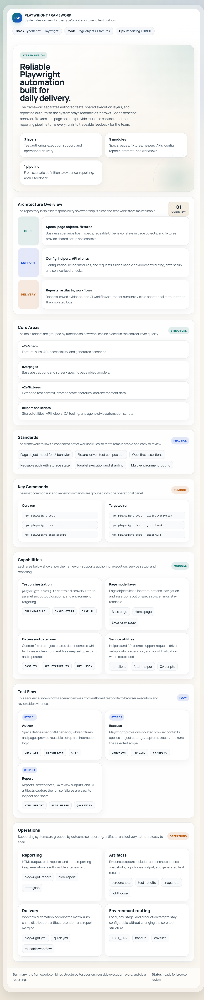

# Playwright End-to-End Suite

This repository contains end-to-end tests using Playwright. Below are instructions for setup, running tests, and useful commands.

## Architecture Overview



The visual overview is exported from `system-design.html` so GitHub users can see the framework layout directly in the repository.

---

## Directory Structure

- **End-to-end tests:** `./e2e`
- **Root directory:** The folder containing the `e2e` directory

---

## Setup & Installation

Install dependencies from the root directory:

```bash
npm install
```

---

## Local Development

Start the local server (for local testing):

```bash
npm run start
```

> **Note:** The server runs in the foreground. Open a new terminal to run tests while the server is running.

---

## Running Tests

Run all end-to-end tests:

```bash
npm run test
```

Run only the smoke/tagged suite:

```bash
npm run test:smoke
```

> **Note:** Only tests tagged with `@smoke` will be executed.

Run only failed tests from the last run:

```bash
npm run test:failed
```

Launch Playwright UI:

```bash
npx playwright test -ui
```

Run tests on a specific environment (dev, stage, prod):

```bash
TEST_ENV=dev npm run test
TEST_ENV=stage npm run test
TEST_ENV=prod npm run test
```

Run Playwright code generation tool:

```bash
npx playwright e2e-codegen
```

---

## Playwright CLI Dashboard and Annotation

Use the Playwright CLI dashboard for interactive inspection and annotation mode.

### NPM shortcuts

```bash
npm run cli:show
npm run cli:show:annotate
npm run cli:show:port
npm run cli:show:kill
```

### Direct CLI commands

```bash
playwright-cli show
playwright-cli show --annotate
playwright-cli show --port 9323
playwright-cli show --port 9323 --host 0.0.0.0
playwright-cli show --kill
```

### Helper scripts

Use these scripts when you want explicit shell or PowerShell entry points.

```bash
# Bash
./scripts/cli-show.sh
./scripts/cli-annotate.sh
./scripts/cli-show-kill.sh
```

```powershell
# PowerShell
./scripts/cli-show.ps1
./scripts/cli-annotate.ps1
./scripts/cli-show-kill.ps1
```

### Typical annotation flow

```bash
# 1) Open regular dashboard
playwright-cli show

# 2) Open dashboard in annotation mode
playwright-cli show --annotate

# 3) Stop dashboard daemon when done
playwright-cli show --kill
```

### AI QA Review Pipeline (Annotation to Artifacts)

This flow converts annotation metadata into structured QA artifacts (bug report, test cases, Playwright draft, visual diff mask, accessibility risks, checklist, Jira payload, and MVP idea).

1) Create an annotation metadata text file from `playwright-cli show --annotate` output:

```bash
cat > .playwright-cli/annotation-input.txt <<'EOF'
{ x: 1037, y: 275, width: 167, height: 245 }: Elements not rendering responsively
{ x: 18, y: 275, width: 175, height: 319 }: Elements not rendering responsively.
{ x: 455, y: 167, width: 386, height: 50 }: This is neither center or anything
{ x: -25, y: 559, width: 45, height: 139 }: Spacing here is weird
EOF
```

2) Run the pipeline:

```bash
npm run qa:annotate:review -- --url https://practice.expandtesting.com/login --annotations-file .playwright-cli/annotation-input.txt
```

3) Review generated output in `reports/qa-review/<timestamp>/`.

---

## Accessibility Testing

Use the `checkA11y()` method from the `BasePage` class for accessibility reports:

```js
checkA11y()
```

---

## Simulate CI/CD Test Run

Run smoke tests in CI/CD simulation:

```bash
npx playwright test -g "@smoke" --repeat-each=100 --workers=10 -x
```

---

## Chrome DevTools MCP for Site Audits

Lighthouse tests are no longer supported directly. Use [chrome-devtools-mcp](https://www.npmjs.com/package/chrome-devtools-mcp) for automated audits and reporting.

### Setup chrome-devtools MCP

1. Configure `.vscode/mcp.json`:

	```jsonc
	"chrome-devtools": {
	  "command": "npx",
	  "args": ["-y", "chrome-devtools-mcp@latest"]
	}
	```

2. Start the MCP server:

	```bash
	npx chrome-devtools-mcp
	```

3. Use the MCP API/CLI to run audits and generate reports. See [chrome-devtools-mcp documentation](https://www.npmjs.com/package/chrome-devtools-mcp) for details.

---

## Run in Docker

To run Playwright tests in Docker, mount your local project folder as a volume and set the working directory:

```bash
docker run -it --rm --ipc=host -v "g:/DataXFaramir/Huge/playwrightFramework:/work" -w /work mcr.microsoft.com/playwright:v1.56.1-noble /bin/bash
```

Once inside the container, run:

```bash
npx playwright test
```